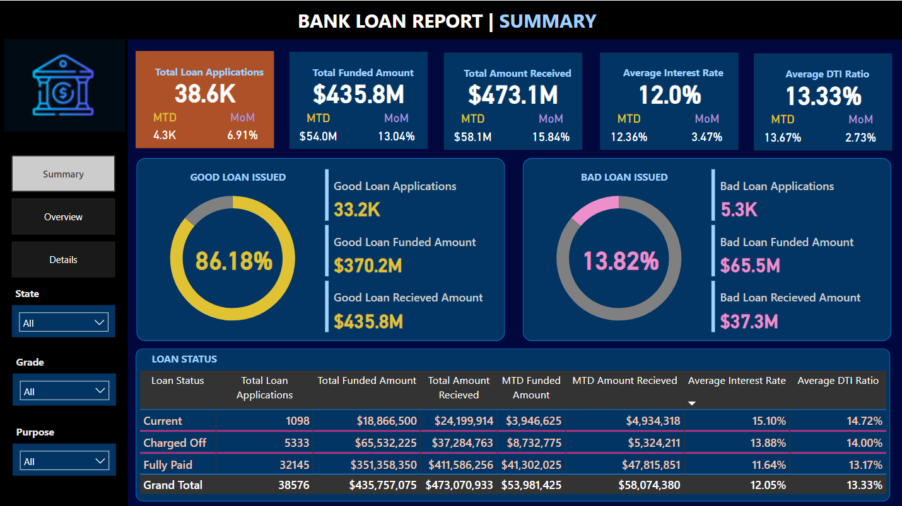
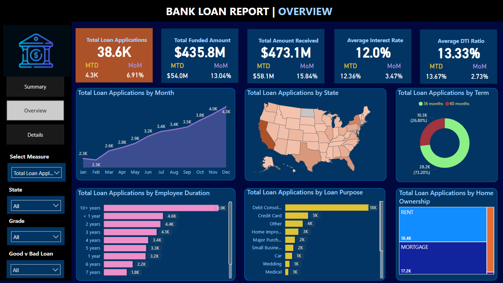
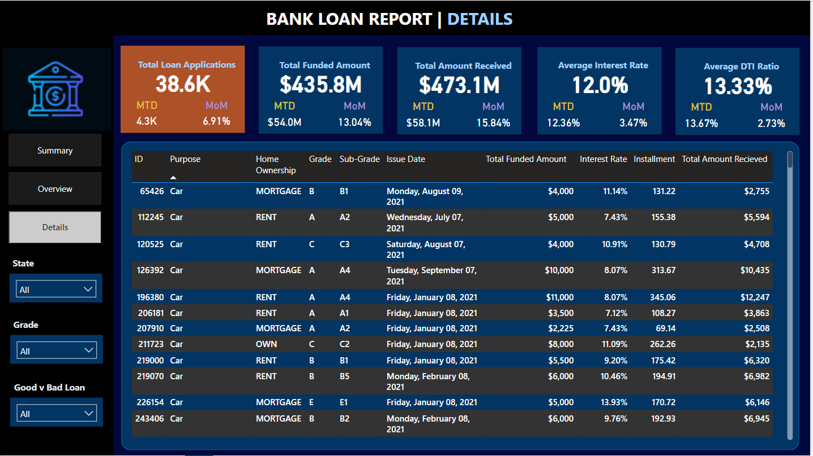

# Bank Loan Analysis Using SQL and Power BI

## Overview

This repository is dedicated to the Bank Loan Analysis project, a comprehensive initiative designed to dissect bank loan data with the aim of uncovering underlying trends, behaviors, and financial outcomes associated with lending processes. By employing advanced data management techniques in SQL Server and utilizing powerful data visualization tools provided by Power BI, the project provides actionable insights into the lending practices of financial institutions. The analysis spans various dimensions including loan application volume, financial health assessments of borrowers, and the performance of loan portfolios. The primary goal is to empower financial analysts and decision-makers with data-driven insights that enable optimized lending strategies, risk mitigation, and enhanced borrower engagement.

## Dataset Description

The `financial_loan` dataset forms the backbone of this analysis and contains critical fields essential for a detailed financial study:

- **Company**: Identifies the bank or financial institution that issued the loan.
- **Total Loan Applications**: Counts the total number of loan applications received, which indicates the demand for loans.
- **Total Funded Amount**: Reflects the aggregate amount of money disbursed as loans, providing insight into the bank's lending activity.
- **Total Amount Received**: Represents the total amount repaid by borrowers, crucial for analyzing cash flow and repayment trends.
- **Average Interest Rate**: Shows the mean interest rate applied across all loans, a critical factor affecting both the attractiveness of loans to borrowers and the bank’s profitability.
- **Average Debt-to-Income Ratio (DTI)**: Provides an average measure of borrowers' debt relative to their income, an important indicator of financial health and loan servicing capability.
- **Date**: Specifies when the loan application was processed or when the loan was disbursed.
- **Country**: Indicates the country in which the loan was issued, useful for regional analysis.
- **Loan Status**: Tracks the current status of the loan, which helps in assessing the health and risk of the loan portfolio.

## Key Performance Indicators (KPIs)

This project focuses on several KPIs to gauge and enhance the effectiveness of lending practices:

- **Total Loan Applications**: A direct measure of how many borrowers are seeking loans, indicative of market demand.
- **Total Funded Amount**: A gauge of how much capital the bank is distributing, reflecting the volume of financial activity.
- **Total Amount Received**: A metric assessing the inflow of repayments, crucial for cash flow management.
- **Average Interest Rate**: Averages the cost of borrowing, influencing the competitive positioning of the bank.
- **Average Debt-to-Income Ratio**: A vital indicator of the risk profile of the loan portfolio, with higher ratios potentially signaling increased risk of default.

## SQL Queries for Data Preparation and Analysis

### Database and Data Management
- **Database Initialization**: Scripts to create and configure the `Finance_project` database within SQL Server. This includes setting up tables and relationships to accurately store and manage loan data.
- **Data Import**: Utilizes SQL commands to import data from external sources (CSV files), ensuring that the database is populated with comprehensive and accurate loan data.

### Analytical Queries
- **Aggregate Queries**: Designed to compile total loans, amounts funded, and repayments into digestible summaries, allowing for quick overviews and detailed drill-downs.
- **Financial Health Metrics**: These queries calculate critical financial metrics such as average interest rates and DTI ratios. They are segmented by various demographic and economic factors to provide targeted insights.
- **Risk Assessment**: Identifies high-risk loan segments by analyzing DTI ratios and default rates, crucial for risk management and mitigation strategies.
- **Trend Analysis**: Employs time-series queries to uncover seasonal patterns and long-term trends in lending, aiding strategic planning and forecasting.

## Power BI Visualization Details

This section elaborates on how data visualized in Power BI provides interactive and dynamic insights through various dashboards. Each dashboard is designed to focus on different aspects of the loan data, offering comprehensive and intuitive access to the information through graphs, charts, and maps.

### Summary Dashboard

The Summary Dashboard provides an overarching view of key financial metrics, with interactive filters for date and loan status. This dashboard includes visuals for total loan applications, funded amounts, amounts received, and distinctions between good and bad loans.

### Overview Dashboard

This dashboard showcases trends over time, highlighting seasonal patterns and long-term shifts in lending practices. It also features geographical distribution of loans and categorizes data by loan purpose and borrower demographics.

### Details Dashboard

The Details Dashboard offers granular insights into individual loans, presenting detailed information such as loan ID, purpose, home ownership status, grade, interest rates, and repayment statuses.

### Interactive Elements

Highlights the use of filters, slicers, and drill-down features that allow users to customize their data views and explore specific areas of interest. These interactive elements enhance the user experience by providing tailored analytical insights based on selected parameters.

## Future Directions

Potential enhancements include:
- **Predictive Modeling**: Using historical data to predict future trends in loan defaults.
- **Real-Time Analytics**: Integrating live data feeds for up-to-the-minute analysis.
- **Economic Impact Analysis**: Correlating loan data with broader economic indicators to assess external influences on lending activities.

## Conclusion

Concludes by reinforcing the value of the project in providing foundational insights for strategic financial decision-making, emphasizing its role in shaping future lending practices and policies within the banking industry.
